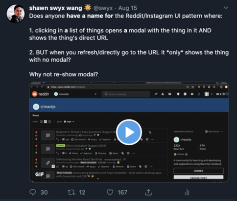

I broke past 10,000 Twitter followers on Saturday. Obviously this is a completely arbitrary milestone and pretty minor in the hierarchy of needs. I'm not celebrating.

A person that -only- values follower count is playing the game Twitter wants you to play, [as Eugene Wei would say](https://www.eugenewei.com/blog/2019/2/19/status-as-a-service), mining the currency they monetize for social status. I don't think I know how to play this game well, although I clearly do it better than some.

But Twitter is an important social network in Tech and in both my social and work circles. I thought I would take this milestone to do some retrospective for those of you who have opted in to follow along my journey (thank you!) and my future self.

This won't be a full retrospective; I first signed up for Twitter 9 years ago, but only started actively using it 2 years ago and things have changed a lot [since my early days](https://dev.to/swyx/scraping-my-twitter-social-graph-with-python-and-selenium--hn8). More on my Twitter Rules of Engagement in a future post.

## What 10,000 Followers Looks Like: By Numbers

First, some numbers.

[SocialBlade](https://socialblade.com/twitter/user/swyx) tracks me gaining between 600-900 followers a month. I follow on average 35 accounts a month (I only occasionally prune silent accounts). I tweet about 40 times a day (including replies; low 16, high 121 in the past fortnight).

Here's my Twitter Analytics halfway through August 2019:

It's better to get an idea of a full month, so looking at July:

- Impressions: 3m
- Mentions: 2,118
- New Follows: 828
- Profile visits: 16.7k
- Tweets: 884
- Engagement: ~1.4%
- Link clicks/day: 335
- RT's/day: 53
- Likes/day: 473
- Replies/day: 50

The Top Follower slot is usually taken by a bot, noticeable by sheer amounts of hashtags, but sometimes I get cool people like [John Maeda](https://twitter.com/johnmaeda) and, even rarer, companies like [Heroku](https://twitter.com/heroku).

My top Tweets are usually memes like [this](https://t.co/fDhFBoCy5F) or parodies like [this](https://mobile.twitter.com/swyx/status/1145694466499588102) or technical stuff like [this](https://mobile.twitter.com/swyx/status/1100809424963219456). Basically I don't have much of a pattern apart from something vaguely technical although I did have one recent notable exception outside my usual beat, which were literally just [pictures of Singapore](https://twitter.com/swyx/status/1137356384796794880).

## What 10,000 Followers Looks Like: By People

Numbers can be bought. Numbers can be gamed by shoveling low quality popcorn down people's throads. Numbers can be gained be channeling outrage and signaling social values. Numbers can arise by doing deep, fundamental work and by you simply posting updates on work that people rely on.

For better or worse, I don't do any of that. I value anecdotally experienced engagement from people I respect. This doesn't mean they have to follow me at all. It just matters that I have the ability and the credibility to reach out to someone when I need to and I pass the "Is this rando worth my time" test. (How to make it worth their time? [Learn in Public.](https://swyx.io/writing/learn-in-public/))

I wasn't planning for this but I recently felt this sheer awe in a [recent tweet](https://mobile.twitter.com/swyx/status/1162200868592029697). I was thinking through a modal interaction I'd implemented before and see all over:

I simply tweeted that because it was something I was working through and didn't know. To this day I don't know what kind of response any individual tweet will get.

Here are the kind of people that replied:

- Chris Coyier (needs no intro)
- Steve Schoger (Design God)
- Ryan Florence (router and modal king)
- 3 Former Facebook Employees (FB first implemented that in Snowlift)

and many more with comments and alternative names and approaches, even tutorials on how to do it.

As awesome as that is, Twitter DM's are even more valuable. That is a level of intimacy on par with and sometimes higher than having someone's number to text back and forth. I got my current job through a Twitter DM, and continue to get an enquiry around once a month. Other backchannel conversations and the rare group DM are also very valuable. (Twitter DMs are inferior to other group chat solutions like text and Whatsapp in every way but one: they're native to the platform.)

This is the kind of thing I'm on Twitter for. A hive mind of people with way more knowledge and abilities than I will ever have, that can help me and that I can hopefully help someday.

## Twitter is AMP for thoughts

The bitesize and free nature of Twitter belies its importance. [If the number one feature of a social network is the people already on it](https://stratechery.com/2018/facebook-lenses/), then Twitter has that on lock as far as developers are concerned (arguably [GitHub is more valuable](https://mobile.twitter.com/swyx/status/1122544240804888578) despite only being acquired for \$7b!). I challenge you to find a single conference where speakers don't mention their twitter handles. I challenge you to find any other social network mentioned.

Yet business founders, even of technical businesses, regularly advise that email is more valuable. I believe they're right for certain types of content, like email marketing and long essays like this one you're reading right now.

But Twitter has value in its constraint. By limiting every tweet to 280 characters, they force some clarity and economy and in turn make the infinite-scroll-feed more valuable and palatable. (By the way: there are very easy hacks to get disproportionate attention for your tweets I should probably write about someday. But it definitely doesn't involve a million hashtags.) Fail to encapsulate important nuance and face wrath from the mob.

By "selling out" to Twitter's requirements, you help add value to Twitter, and Twitter in turn gets you the distribution you want to other people, and by their interaction, adds value to you. Your Twitter followers are fans of yours, but only loosely. Their fanhood is (implicitly) conditional upon and improved by you following The Format and your reward for behaving is getting more notice faster.

Twitter is AMP for thoughts. Like the real AMP, it is a deal with the devil to do things that are probably good for you anyway.

## Loose Fans and What I'm Doing About It

Kevin Kelly famously wrote about how far you can go with [1000 True Fans](https://kk.org/thetechnium/1000-true-fans/). It's about "true" fandom, but also about how you can make a living serving the long tail, which is very true.

However it is not true for Twitter. You grow in Twitter by participating in tribes, and eventually (maybe) leading and growing your own, the bigger the better.

Twitter followers are "loose" fans. They haven't paid for anything from you, they haven't opted in for "your whole self" or pictures of what you had for Sunday brunch, they have simply opted to follow you to improve their main feed or keep tabs on something you're doing that is relevant to their interests. (There are also ways to modify this, via lists and muting, that I should write about in future.) It's very hard to call them to action mainly because you'll never be sure if they even see it. Them's the shakes.

Many aren't even really "fans". They may be there just to try to prove they're smarter than you or to endlessly nag or stalk you. This is especially obvious at higher follower counts. This is part of why I don't relish the thought of 10xing followers, because although it will probably open up more opportunities, it will take away a lot of what I enjoy about my current Twitter experience.

The two ways I am dealing with this now are by starting to put work into my email list for this blog you are reading, and also by making plans for my own Twitter client. I intend this to be a lifelong project.
